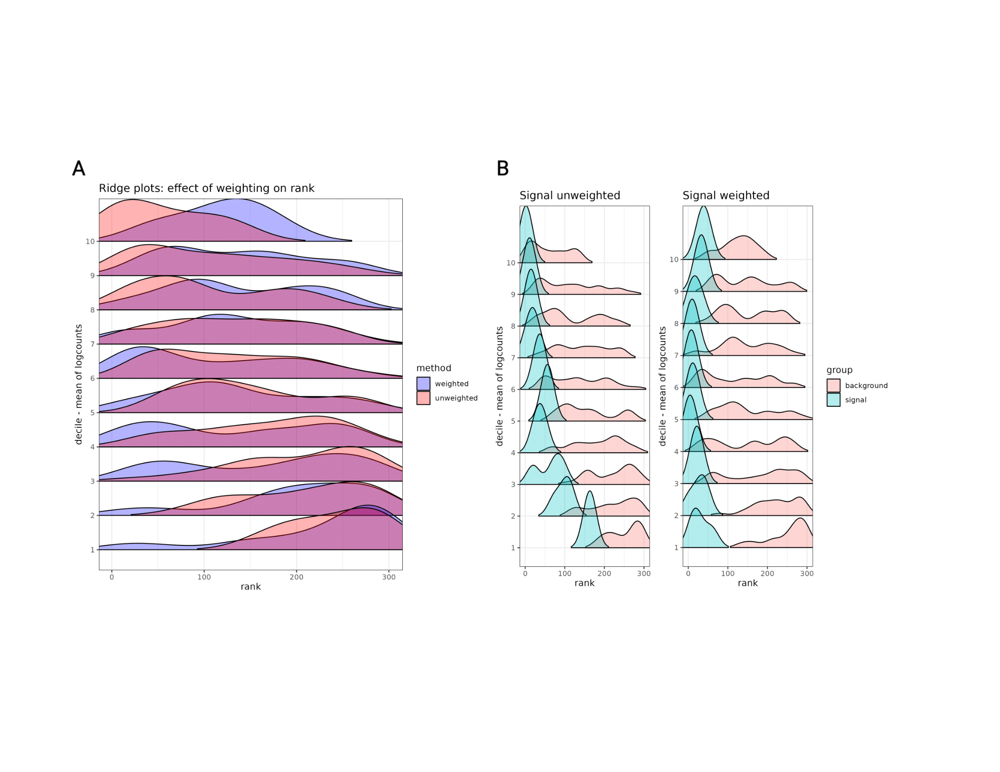

# Introduction

`spoon` is a method to address the mean-variance relationship in
spatially resolved transcriptomics data. Current approaches rank
spatially variable genes based on either p-values or some effect size,
such as the proportion of spatially variable genes. However, previous
work in RNA-sequencing has shown that a technical bias, referred to as
the "mean-variance relationship", exists in these data in that the
gene-level variance is correlated with mean RNA expression. We found
that there is a "mean-variance relationship" in spatial transcriptomics
data, and so we propose `spoon`, a statistical framework to prioritize
spatially variable genes that is not confounded by this relationship. We
fit a spline curve to estimate the mean-variance relationship. Then,
similar to using weights in a weighted least squares model, we used
weights that we plugged into a Gaussian Process Regression model fit
with a nearest-neighbor Gaussian process model to the preprocessed
expression measurements for each gene, i.e. one model per gene. `spoon`
removes the bias and leads to a more informative set of spatially
variable genes.

The `generate_weights()` function calculates individual observation
weights, where an individual observation is a UMI (unique molecular
identifier) count value for a specific gene and sample. If the desired
SVG detection method accepts weights, then the individual observation
weights can be used as inputs. If the desired SVG detection method does
not accept weights, then the Delta method is leveraged to rescale the
data and covariates by the weights. These scaled data and covariates are
used as inputs into the desired SVG detection function.

# Installation

The following code will install the latest release version of the
`spoon` package from Bioconductor. Additional details are shown on the
[Bioconductor](https://bioconductor.org/packages/spoon) page.

```{r, eval=FALSE}
install.packages("BiocManager")
BiocManager::install("spoon")
```

The latest development version can also be installed from the `devel`
version of Bioconductor or from
[GitHub](https://github.com/kinnaryshah/spoon).

# Input data format

We recommend the input data be provided as a
[SpatialExperiment](https://bioconductor.org/packages/SpatialExperiment)
Bioconductor object. The outputs are stored in the `rowData` of the
`SpatialExperiment` object. The examples below use this input data
format.

The inputs can also be provided as a numeric matrix of raw counts and a
numeric matrix of spatial coordinates.

# Tutorial

**Load packages and data**

```{r}
library(nnSVG)
library(STexampleData)
library(SpatialExperiment)
library(BRISC)
library(BiocParallel)
library(scuttle)
library(Matrix)
library(purrr)
library(spoon)

spe <- Visium_mouseCoronal()
```

**Preprocessing**

```{r}

# keep spots over tissue
spe <- spe[, colData(spe)$in_tissue == 1]

# filter out low quality genes
spe <- filter_genes(spe)

# calculate logcounts (log-transformed normalized counts) using scran package
spe <- computeLibraryFactors(spe)
spe <- logNormCounts(spe)

# choose a small number of genes for this example to run quickly
set.seed(3)
ix_random <- sample(seq_len(nrow(spe)), 10)
spe <- spe[ix_random, ]

# remove spots with zero counts
spe <- spe[, colSums(logcounts(spe)) > 0]
```

**Step 1: generate weights**

```{r}
weights <- generate_weights(input = spe,
                            stabilize = TRUE,
                            BPPARAM = MulticoreParam(workers = 1,
                                                     RNGseed = 4))
```

**Step 2: weighted SVG detection**

```{r}
spe <- weighted_nnSVG(input = spe,
                      w = weights,
                      BPPARAM = MulticoreParam(workers = 1, RNGseed = 5))
```

**Show results**

```{r}
# display results
rowData(spe)
```

**Other SVG detection tools**

We provided a function to use the weights with
[nnSVG](https://www.nature.com/articles/s41467-023-39748-z) for more
accurate spatially variable gene detection. The weights can also be used
with other spatially variable gene detection tools using the following
procedure:

```{r, eval=FALSE}
assay_name <- "logcounts"
weighted_logcounts <- t(weights)*assays(spe)[[assay_name]]
assay(spe, "weighted_logcounts") <- weighted_logcounts
```

`weighted_logcounts` can be accessed from
`assay(spe, "weighted_logcounts")`. Then, `weighted_logcounts` should be
used as the input counts matrix and `weights` as the input covariate
matrix in a spatially variable detection tool.

# Adressing the mean-variance relationship

In the Tutorial section, we showed how to use the functions in `spoon`
on a small number of genes for a faster runtime. This section will show
how these methods address the mean-variance relationship in spatial
transcriptomics data. The code below takes several hours to run, but can
be reproduced if desired.

**Simulate data**

```{r, eval=FALSE}
library(SpatialExperiment)
library(STexampleData)
library(MASS)
library(scuttle)

set.seed(1)

#4992 spots and 300 genes

n_genes <- 300
fraction <- 0.5
max_sigma.sq <- 1
low_range_beta <- c(0.5,1)

#check if integer
stopifnot(n_genes*fraction*0.5 == round(n_genes*fraction*0.5))

#all genes have some nonzero sigma.sq
sigma.sq <- runif(n_genes, 0.2, max_sigma.sq)
ground_truth_rank <- rank(-sigma.sq)

#all genes will have nonzero beta values
beta <- runif(n_genes, log(low_range_beta[1]), log(low_range_beta[2]))

#choose fixed length scale parameter (~medium from nnSVG paper)

scale_length <- 200

params <- data.frame(sigma.sq, beta)

plot(beta, sigma.sq)

#sampling from a poisson distribution - mean controls variance, so we don't specify tau.sq:
#step 1: use ST example distance matrix instead of creating a new one (Euclidean distance)

spe_demo <- Visium_humanDLPFC()
points_coord <- spatialCoords(spe_demo)
n_points <- nrow(points_coord)

pair.points <- cbind(
  matrix( rep(points_coord, each = n_points), ncol = 2, byrow = FALSE),
  rep(1, times = n_points) %x% points_coord # Creating the combinations using kronecker product.
) |> data.frame()
colnames(pair.points) <- c("si.x", "si.y", "sj.x", "sj.y")

#step 2: calculate gaussian process/kernel 

kernel.fun <- function(si.x, si.y, sj.x, sj.y,  l = 0.2){
  exp(-1*sqrt(((si.x-sj.x)^2+(si.y-sj.y)^2))/l)
}

C_theta <- with(pair.points, kernel.fun(si.x, si.y, sj.x, sj.y, l = scale_length)) |> 
  matrix(nrow = n_points, ncol = n_points)

counts <- matrix(NA, nrow = n_genes, ncol = n_points)
eta_list <- list()

for (i in c(1:n_genes)) {
  
  sigma.sq_i <- sigma.sq[i]
  beta_i <- beta[i]

  #step 3: simulate gaussian process per gene
  
  gp_dat <- mvrnorm(n = 1, rep(0,n_points), sigma.sq_i* C_theta) 

  #step 4: calculate lambda = exp(beta + gaussian process) per gene
  
  lambda_i <- exp(gp_dat + beta_i)

  #step 5: use rpois() to simulate 4992 values per gene

  counts_i <- rpois(n = n_points, lambda_i)
  
  #put all counts in matrix 
  #orientation: genes x spots
  
  counts[i,] <- counts_i
}

#create spe using counts and distance matrix

spe <- SpatialExperiment(
    assays = list(counts = counts),
    spatialCoords = points_coord)

rowData(spe)$ground_truth <- ground_truth
rowData(spe)$ground_truth_rank <- ground_truth_rank
rowData(spe)$ground_truth_sigma.sq <- sigma.sq
rowData(spe)$ground_truth_beta <- beta

```

**Generate weights and SVG detection**

```{r, eval=FALSE}
library(SpatialExperiment)
library(nnSVG)
library(BRISC)
library(BiocParallel)
library(scuttle)

spe <- spe[, colSums(counts(spe)) > 0]
spe <- logNormCounts(spe)
weights <- generate_weights(input = spe, stabilize = TRUE)
spe_unweighted <- nnSVG(spe, assay_name = "logcounts")
spe_weighted <- weighted_nnSVG(input = spe, w = weights)
```

**Visualize effect of weighting**

```{r, eval=FALSE}
library(ggplot2)
library(SpatialExperiment)
library(patchwork)
library(GGally)
library(dplyr)
library(ggridges)

#overlay unweighted and weighted ridge plots
df_unw <- data.frame(
  rank = rowData(spe_unweighted)$rank,
  mean = rowData(spe_unweighted)$mean,
  method = rep("unw", 300) 
) %>% mutate(quantile = findInterval(mean, 
                quantile(mean, probs=0:9/10))) %>%
  tibble::rownames_to_column()

df_w <- data.frame(
  rank = rowData(spe_weighted)$weighted_rank,
  mean = rowData(spe_weighted)$weighted_mean,
  method = rep("w", 300) 
) %>% mutate(quantile = findInterval(mean, 
                quantile(mean, probs=0:9/10))) %>%
  tibble::rownames_to_column()

df <- rbind(df_unw, df_w) %>% 
  mutate(quantile = as.factor(quantile))

ridge_overlay <- ggplot(df, aes(x = rank, y = quantile)) +
  geom_density_ridges2(aes(fill = method), rel_min_height = 0.02, alpha = 0.3, scale = 1.3) +
  theme_ridges(grid = TRUE) +
  labs(
    y = "decile - unw & w mean of logcounts",
    x = "rank",
    title = "Ridge plots: effect of weighting on rank"
  ) +
  scale_fill_manual(labels = c("weighted", "unweighted"), values = c("blue", "red")) +
  coord_cartesian(xlim = c(1, 300)) +
  theme_bw()

#ridge plots separated by noise and signal for unweighted and weighted
frac <- round(dim(spe_unweighted)[1]*0.1)*0.1

df_unw_signal <- df_unw %>%
  mutate(quantile = as.factor(quantile)) %>%
  group_by(quantile) %>%
  slice_min(order_by = rank, n = frac) %>%
  mutate(grp = "signal")

indices <- as.integer(df_unw_signal$rowname)

df_unw_background <- df_unw[-indices,] %>%
  mutate(quantile = as.factor(quantile)) %>%
  mutate(grp = "background")

df <- rbind(df_unw_signal, df_unw_background)

rank_separated_unw <- ggplot(df, aes(x = rank, y = quantile)) +
  geom_density_ridges2(aes(fill = grp), rel_min_height = 0.02, alpha = 0.3) +
  theme_ridges(grid = TRUE) +
  labs(
    y = "decile - unw mean of logcounts",
    x = "rank",
    title = "Signal unweighted"
  ) +
  guides(fill=guide_legend(title="group")) +
  coord_cartesian(xlim = c(1, 300)) +
  theme_bw() 
  
df_w_signal <- df_w %>%
  mutate(quantile = as.factor(quantile)) %>%
  group_by(quantile) %>%
  slice_min(order_by = rank, n = frac) %>%
  mutate(grp = "signal")

indices <- as.integer(df_w_signal$rowname)

df_w_background <- df_w[-indices,] %>%
  mutate(quantile = as.factor(quantile)) %>%
  mutate(grp = "background")

df <- rbind(df_w_signal, df_w_background)

rank_separated_w <- ggplot(df, aes(x = rank, y = quantile)) +
  geom_density_ridges2(aes(fill = grp), rel_min_height = 0.02, alpha = 0.3) +
  theme_ridges(grid = TRUE) +
  labs(
    y = "decile - w mean of logcounts",
    x = "rank",
    title = "Signal weighted"
  )  +
  guides(fill=guide_legend(title="group")) +
  coord_cartesian(xlim = c(1, 300)) +
  theme_bw() 

ridge_signal <- wrap_plots(rank_separated_unw, rank_separated_w, nrow=1, guides = "collect") 
```

These code chunks have been evaluated and lead to the figure below with
both ridge plots. All the simulated genes are spatially varying genes,
but to different degrees, and the controlled mean and spatial variance
parameters are not correlated. After simulating the data, weights were
generated and constrained. To rank SVGs,
[nnSVG](https://www.nature.com/articles/s41467-023-39748-z) was run on
both the unweighted logcounts and on the weighted logcounts matrices.
This figure shows the comparison between unweighted nnSVG ranks and
weighted nnSVG ranks within deciles based on mean expression. The
distribution of ranks moves toward zero for lower mean expression
deciles after the weighting is applied, indicating that SVGs are able to
be found even when they have low expression (subfigure A). Each decile
has spatially variable genes that should be highly ranked, and the
weighted method is able to recover these in the lowly expressed deciles.
In order to separate background noise from true signal, the densities of
the top three ranks from each decile are plotted separately from the
remaining genes in each decile (subfigure B). The weighted method is
able to find highly ranked SVGs even in lower deciles, showing that
`spoon` addresses the mean-variance relationship.



# Session information

```{r}
sessionInfo()
```
